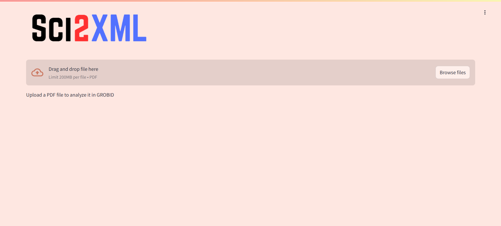
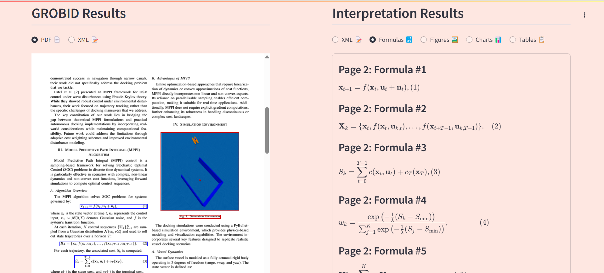

---
<div style="display: flex; flex-direction: column; align-items: center;">
  
  
</div>

[](LICENSE)
[](https://streamlit.io/)
[](https://www.python.org/)
## Overview  
This repository provides a pipeline for converting research PDFs into structured XML using [**GROBID**](https://github.com/kermitt2/grobid), a **custom classification model**, and specialized OCR tools. It supports multiple execution modes: **Streamlit UI** and **terminal**.  

Developed as part of our **bachelor’s project in collaboration with SINTEF** for the [**enRichMyData**](https://www.sintef.no/en/projects/2022/enrichmydata/) initiative.  

---

## Features  
- **Preprocessing with GROBID** to extract metadata and structure.  
- **Custom classification model** to validate extracted sections.  
- **Specialized OCR and data extraction tools**:  
  - [**Sumen**](https://github.com/hoang-quoc-trung/sumen) – Converts formulas to LaTeX.  
  - [**Unichart**](https://github.com/vis-nlp/UniChart) – Extracts and summarizes chart data.  
  - [**pdfplumber**](https://github.com/jsvine/pdfplumber) – Parses tables accurately.
  - [**Moondream**](https://github.com/vikhyat/moondream) - Captions figures  
- **Multiple execution modes**: Streamlit UI and terminal

---

## Installation  

### Prerequisites

- GPU with CUDA support  
  In Google Colab: go to `Runtime > Change runtime type > GPU (T4)`
- Ngrok Authtoken  
  Get yours from: https://dashboard.ngrok.com/get-started/your-authtoken

### Clone the Repository

```bash
git clone https://github.com/younes2808/Sci2XML.git
```
### Launch the Web Interface (Streamlit)

```bash
python Sci2XML/app/launch.py --authtoken YOUR_AUTHTOKEN
``` 
Wait 5 to 15 minutes for the models and dependencies (like GROBID) to load.

After launch, you will receive a public Ngrok URL. You can open it to access the interface.

> **Note**: If you see an error about model loading, wait 10 minutes and try again. This can happen due to Hugging Face connection issues.

### Run the Terminal CLI
```bash
python Sci2XML/app/run_pipeline.py --authtoken YOUR_AUTHTOKEN --nl_formula True/False(Default set to False)
```
Wait 5 to 15 minutes for setup

**Once ready**, an interactive CLI will appear.

Available commands:

```
pdf: Process a single PDF (you'll be prompted for file path and output XML name)

folder: Process all PDFs in a directory

exit: Quit the CLI
```

> **Note for Google Colab users**: Press **Enter** when the **CLI** asks for input to create a newline. This is the only way for input to be recognised in Colab.

---

## Contributors

- [Morten Nilsen](https://github.com/SameNilsen)  
- [Jan Axel Støre Ørmen](https://github.com/axelsormen)
- [Rafey Ul-Islam Afzal](https://github.com/R4f3y)  
- [Shoeb Mohammadi](https://github.com/shoeb03)  
- [Younes Benhaida](https://github.com/younes2808)

## Acknowledgements  
We want to thank the developers and contributors of [pdfplumber](https://github.com/jsvine/pdfplumber), [GROBID](https://github.com/kermitt2/grobid), [Sumen](https://github.com/hoang-quoc-trung/sumen), [Moondream](https://github.com/vikhyat/moondream), and [Unichart](https://github.com/vis-nlp/UniChart) for their invaluable tools and contributions to document processing. This project would not have been possible without their dedication to open-source innovation. Thank you!
