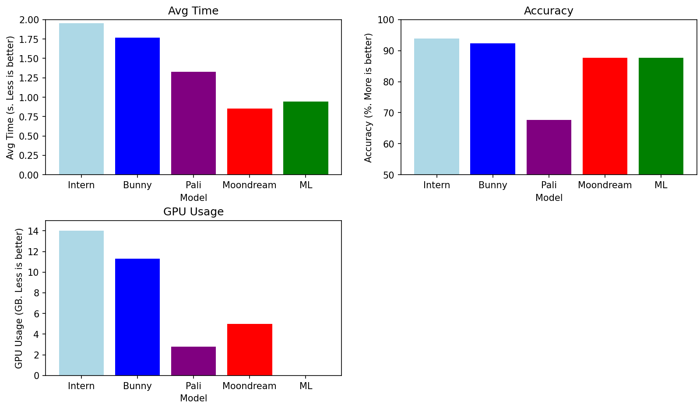
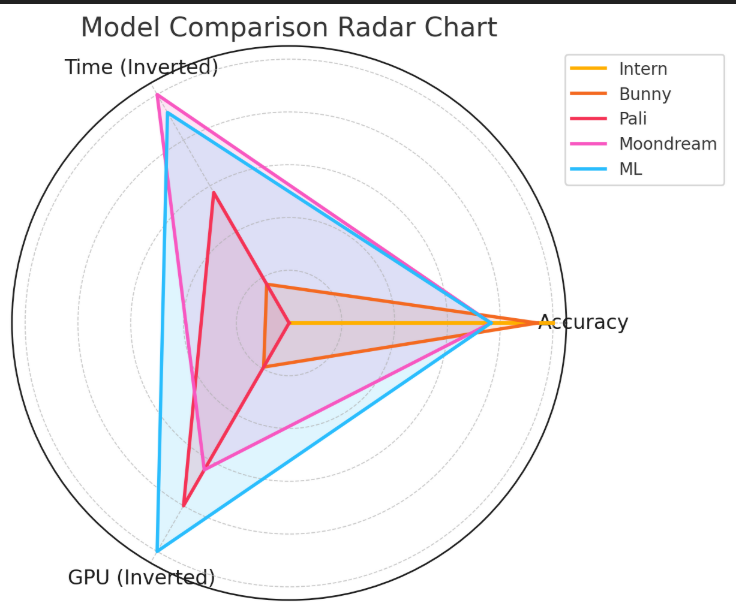

# Evaluating Classifier models

This repository contains an evaluation framework to compare and assess four classifiers, three VLMs [PaliGemma-3B](https://huggingface.co/google/paligemma2-3b-pt-224), [InternVL2.5-2B](https://huggingface.co/OpenGVLab/InternVL2_5-2B), [Moondream](https://github.com/vikhyat/moondream), [Bunny](https://huggingface.co/BAAI/Bunny-v1_0-3B) and a ML model [DenseNet-169](https://www.kaggle.com/code/sunedition/classification-of-graphs). 

## Dataset Description

The dataset contains labeled images of graphs, tables, figures and other. The images were extracted from scientific papers by GROBID, and vary in complexity and domain. The 'other' category are images where GROBID misintepreted something as figures, and are used to ensure the classifier is able to handle outliers.

## Purpose

The purpose is to assess whether a classifier model is able to accurately and efficiently classify images of different origin and type. 

## Evaluation

The evaluation is done on Google Colab with T4 GPU enabled. Follow the instructions in the python notebook file ClassifierBenchmark.ipynb. Here you will be able to select and load the desired model to be tested, and run evaluation on it. The results will be saved to file in Results foler.

## Results

